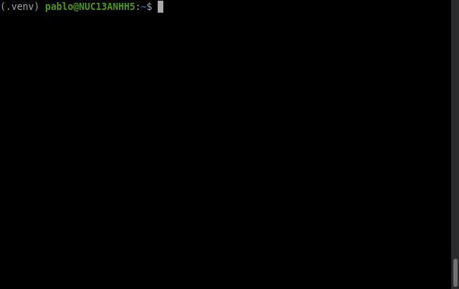
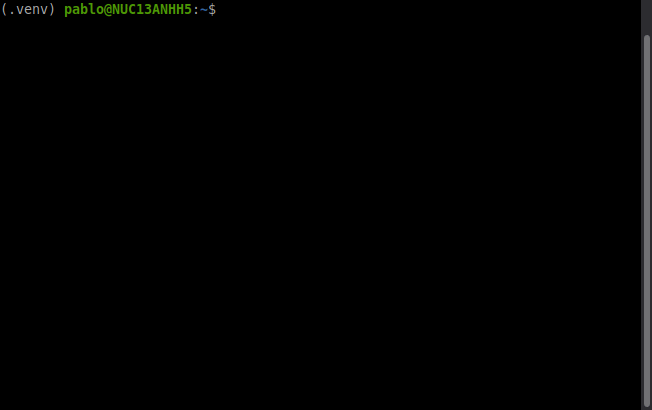

# sshq: AI-assisted SSH wrapper

`sshq` is a drop-in replacement for standard `ssh` that brings the power of AI to offline embedded Linux targets. 

It seamlessly injects a lightweight, AI-powered query command (`q`) into your SSH session, allowing you to ask for complex shell commands without ever leaving your terminal or searching the web.



## Why `sshq`?

When working on embedded boards (like Yocto or Buildroot builds), you often face two problems:
1. The board has no internet access, so you can't run AI CLI tools directly on it.
2. Even if it did have internet, you **never** want to put your personal API keys on a target device.

`sshq` solves both.

## How it Works

1. **The Host Server:** When you run `sshq`, it spins up a lightweight local web server in the background on your laptop. This server talks to your chosen AI backend: local (RamaLama/Ollama) if `SSHQ_USE_LOCAL=1`, else Groq if `GROQ_API_KEY` is set, otherwise Gemini.
2. **The Reverse Tunnel:** `sshq` wraps your standard `ssh` command and adds a reverse port forward to a random local port, creating a secure tunnel from the board back to your laptop.
3. **Transparent Injection:** During login, `sshq` passes a Python one-liner to the board (the `q` client script) and drops it into `~/.local/bin/q`, and immediately hands you an interactive shell.

## Prerequisites

* Python 3.9 or higher (on your host machine).
* An AI backend (choose one):
  * **Local model** (RamaLama, Ollama, llama.cpp): set `SSHQ_USE_LOCAL=1` and run a local OpenAI-compatible server (see [Local / RamaLama](#local--ramalama) below).
  * **Groq** (free tier): get a key from [Groq Console](https://console.groq.com/). If set, `GROQ_API_KEY` is used when local is not enabled.
  * **Gemini**: get a key from [Google AI Studio](https://aistudio.google.com/) or Google Cloud console (used when neither local nor Groq is set).
* Python 3 installed on the target embedded board (standard library only; no external packages required).

## Installation

Using `pip`:

```bash
pip install git+https://github.com/pridolfi/sshq.git
```

(Note: You can also clone the repo and use `pip install -e .` if you plan to modify the code).

## Usage
1. Configure your AI backend (see [Environment variables](#environment-variables)). For cloud backends, export the API key; for local, set `SSHQ_USE_LOCAL=1` and ensure a local server is running.

   **Local (RamaLama / Ollama / llama.cpp):**

   ```bash
   export SSHQ_USE_LOCAL=1
   # Optional: export SSHQ_LOCAL_BASE_URL="http://127.0.0.1:8080/v1"
   # Optional: export SSHQ_LOCAL_MODEL="tinyllama"
   ```

   **Groq** (free tier):

   ```bash
   export GROQ_API_KEY="your_groq_api_key_here"
   ```

   **Gemini** (used when local and Groq are not set):

   ```bash
   export GEMINI_API_KEY="your_gemini_api_key_here"
   ```

2. Connect to your board exactly as you normally would, just replace ssh with sshq:

```bash
sshq root@192.168.1.100
```
(Note: Any standard SSH flags, like `-i key.pem` or `-p 2222`, will work perfectly).

3. Once connected to the board, use the `q` command to ask for shell commands. The AI will suggest a command, print it in bold cyan, and ask if you want to run it:

```bash
$ q find the top 5 largest files in /var/log

find /var/log -type f -exec du -Sh {} + | sort -rh | head -n 5

Do you want to execute this command? [y/N] y

15M     /var/log/syslog
10M     /var/log/messages
8.2M    /var/log/kern.log
5.1M    /var/log/auth.log
2.3M    /var/log/dpkg.log

$ q extract the tarball archive.tar.gz to /tmp

tar -xzf archive.tar.gz -C /tmp

Do you want to execute this command? [y/N] n
$
```

## File Analysis with `--analyze`

In addition to command suggestions, `sshq` provides AI-powered file analysis capabilities. Use the `--analyze` flag with the `q` command to ask questions about files on your embedded board.



### Usage

```bash
q --analyze <file_path> <your_question>
```

### Example

```
$ q --analyze /proc/cpuinfo What CPU architecture and features does this system have? Explain them briefly.
The system has the following CPU architecture and features:

CPU Architecture:
- 8: This indicates an ARMv8-A architecture, which is a 64-bit instruction set architecture.

CPU Features:
- fp: Floating Point - Hardware support for floating-point arithmetic.
- asimd: Advanced SIMD (Single Instruction, Multiple Data) - Provides parallel processing capabilities for multimedia and signal processing.
- evtstrm: Event Stream - Support for performance monitoring unit (PMU) event streams.
- aes: Advanced Encryption Standard - Hardware acceleration for AES encryption and decryption.
- pmull: Polynomial Multiply - Hardware support for polynomial multiplication, often used in cryptographic operations like GCM.
- sha1: Secure Hash Algorithm 1 - Hardware acceleration for SHA-1 hashing.
- sha2: Secure Hash Algorithm 2 - Hardware acceleration for SHA-2 (SHA-256, SHA-512) hashing.
- crc32: Cyclic Redundancy Check 32-bit - Hardware acceleration for CRC32 calculations, used for data integrity checks.
- atomics: Atomic operations - Hardware support for atomic memory operations, crucial for multi-threaded programming.
- fphp: Half-precision Floating Point - Support for 16-bit half-precision floating-point numbers.
- asimdhp: Half-precision Advanced SIMD - SIMD operations that can operate on half-precision floating-point data.
- cpuid: CPU ID - Instruction to read CPU identification and feature registers.
- asimdrdm: Advanced SIMD Rounding Double Multiply Accumulate - SIMD instructions for rounding double multiply accumulate operations.
- lrcpc: Load-acquire/Release Consistency Point Cache - Support for Load-acquire/Release instructions for memory consistency.
- dcpop: Data Cache Zero - Instruction to zero a cache line without loading it from memory.
- asimddp: Advanced SIMD Dot Product - SIMD instructions for dot product operations, useful for machine learning workloads.
```

## Agentic mode with `--agentic`

For goals that need **several** shell steps (investigate, then drill down, then summarize), use agentic mode. You describe the outcome you want; the AI suggests one command at a time. After each run, **stdout and stderr** are sent back through the tunnel to your laptop, and the model either proposes the next command or returns a **final answer** when it has enough information.

This is the same safety model as plain `q`: each command is shown in bold cyan and you confirm with **y** before it runs.

### Usage

```bash
q --agentic <your goal or question>
```

Optional environment variables (read in the **shell where `q` runs**, usually on the board) are listed in [Environment variables](#environment-variables) under `SSHQ_AGENTIC_*`.

### Example

```bash
$ q --agentic analyze the process consuming the most CPU over the last 15 minutes

[agentic step 1/25]
pidstat 1 1

Run this command? [y/N] y
(... command output appears here ...)

[agentic step 2/25]
grep ...

Run this command? [y/N] y
(...)

Based on the command output, the process that consumed the most CPU over the last 15 minutes was ...
```

## Local / RamaLama

You can run inference entirely on your machine using [RamaLama](https://ramalama.ai/) (or any OpenAI-compatible server like Ollama or llama.cpp). No API keys are required.

**Managed mode (no extra commands):** If you set `SSHQ_USE_LOCAL=1` and do **not** set `SSHQ_LOCAL_BASE_URL`, sshq will start RamaLama automatically when you connect (on port 8080, or `SSHQ_RAMALAMA_PORT`) and stop it when you disconnect. Install RamaLama once, then just run sshq:

   ```bash
   curl -fsSL https://ramalama.ai/install.sh | bash
   export SSHQ_USE_LOCAL=1
   sshq root@192.168.1.100
   ```

   The first connection may take a minute while the model loads. If port 8080 is already in use (e.g. you started `ramalama serve` yourself), sshq uses that server and does not stop it on exit.

**Manual mode:** To run RamaLama yourself and have sshq only connect to it, set both:

   ```bash
   export SSHQ_USE_LOCAL=1
   export SSHQ_LOCAL_BASE_URL="http://127.0.0.1:8080/v1"
   # Optional: SSHQ_LOCAL_MODEL defaults to llama3.2:1b.
   sshq root@192.168.1.100
   ```

**Behavior with small local models:** Command responses are post-processed: markdown code blocks (e.g. `\`\`\`bash ... \`\`\``) are stripped and only the single shell command is returned. Analysis replies are limited in length to reduce repetitive run-on output. For best results, use a 1B+ instruction-tuned model (e.g. Llama 3.2 1B Instruct, SmolLM2, Phi-2) when your hardware allows.

The local backend uses the same OpenAI `chat/completions` API that RamaLama’s default llama.cpp server exposes, so no extra dependencies are needed beyond the existing `openai` package.

## Environment variables

| Variable | Required | Default | Description |
|----------|----------|---------|-------------|
| `SSHQ_USE_LOCAL` | No | — | Set to `1`, `true`, or `yes` to use a local OpenAI-compatible server (e.g. RamaLama). |
| `SSHQ_LOCAL_BASE_URL` | No | — | If unset with `SSHQ_USE_LOCAL=1`, sshq starts and stops RamaLama for you. If set, sshq uses this URL and does not manage the server. |
| `SSHQ_RAMALAMA_PORT` | No | `8080` | Port for sshq-managed RamaLama (only when `SSHQ_LOCAL_BASE_URL` is unset). |
| `SSHQ_LOCAL_MODEL` | No | `llama3.2:1b` | Model to serve (managed mode) or name for API (manual mode). Ollama uses colon e.g. `llama3.2:1b`. |
| `GROQ_API_KEY` | No (after local) | — | Your Groq API key (free at [console.groq.com](https://console.groq.com)). If set and local not used, Groq is used. |
| `GEMINI_API_KEY` | Yes (if neither local nor Groq) | — | Your Gemini API key. |
| `SSHQ_GEMINI_MODEL` | No | `gemini-2.5-flash` | Gemini model (e.g. `gemini-2.5-flash-lite` for higher quota). |
| `SSHQ_GROQ_MODEL` | No | `llama-3.3-70b-versatile` | Groq model (e.g. `llama-3.1-8b-instant` for faster replies). |
| `SSHQ_AGENTIC_MAX_STEPS` | No | `25` | Maximum suggest/run rounds for `q --agentic` (evaluated on the target shell). |
| `SSHQ_AGENTIC_MAX_OUTPUT_CHARS` | No | `32000` | Per-step cap on captured stdout/stderr sent back to the model (each stream gets half before truncation). |
